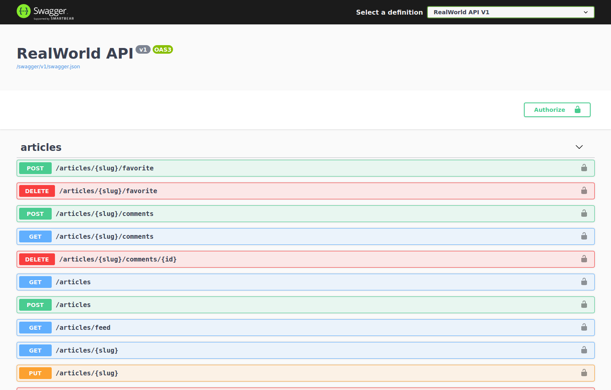

# 

> ### ASP.NET Core codebase containing real world examples (CRUD, auth, advanced patterns, etc) that adheres to the [RealWorld](https://github.com/gothinkster/realworld-example-apps) spec and API.

### [Mundo real](https://github.com/wallacecamacho/Codebase)

Projeto de referência para ilustrar uma arquitetura de aplicação construída com ASP.NET Core utilizando libs, e executando operações
de CRUD, autenticação, rotas, paginação e etc.

# Primeiros passs

Intalação do .NET Core SDK : [https://www.microsoft.com/net/download/core](https://www.microsoft.com/net/download/core)

Documentação ASP.NET Core: [https://docs.microsoft.com/en-us/aspnet/core/](https://docs.microsoft.com/en-us/aspnet/core/)

## Docker Build

Existe um 'Makefile' para OS X e Linux:

- `make build` ececuta `docker-compose build`
- `make run` executa `docker-compose run`

O exemplo acima pode funcionar para o Docker no Windows

## Local building

- Instale Cake globalmente: `dotnet tool install -g Cake.Tool`
- Execute o Cake: `dotnet-cake`
  - Nota: Use o parâmetro do Cake argument `runtime` passando um RID explicado aqui: https://docs.microsoft.com/en-us/dotnet/core/rid-catalog
  - Ex: dotnet-cake --runtime=linux-x64, dotnet-cake --runtime=osx.10.12-x64
  - `Dockerfile` usa para publicar para o
  -  Alpine

# Como funciona

ASP.NET Core com:

- CQRS and [MediatR](https://github.com/jbogard/MediatR)
  - [Simplificando desenvolvimento e separando acoplamentos com MediatR](https://blogs.msdn.microsoft.com/cdndevs/2016/01/26/simplifying-development-and-separating-concerns-with-mediatr/)
  - [CQRS com MediatR e AutoMapper](https://lostechies.com/jimmybogard/2015/05/05/cqrs-with-mediatr-and-automapper/)
  - [Controllers com CQRS e MediatR](https://codeopinion.com/thin-controllers-cqrs-mediatr/)
- [AutoMapper](http://automapper.org)
- [Fluent Validation](https://github.com/JeremySkinner/FluentValidation)
- Pastas com arquivo sln
- [Entity Framework Core](https://docs.microsoft.com/en-us/ef/) com SQLite para exemplo de persistência demo purposes. Pode ser facilmente qualquer outra coisa que o EF Core suporte. Aberto para portar para outros ORMs / DBs.
- Swagger via [Swashbuckle.AspNetCore](https://github.com/domaindrivendev/Swashbuckle.AspNetCore)
- [Cake](http://cakebuild.net/) para building!
- JWT authentication [ASP.NET Core JWT Bearer Authentication](https://github.com/aspnet/Security/tree/master/src/Microsoft.AspNetCore.Authentication.JwtBearer).

Essa arquitetura básica é baseada nessa arquitetura de referência: [https://github.com/jbogard/ContosoUniversityCore](https://github.com/jbogard/ContosoUniversityCore) e [https://github.com/gothinkster/aspnetcore-realworld-example-app](https://github.com/gothinkster/aspnetcore-realworld-example-app)

## Swagger URL
- `http://localhost:5000/swagger`

## Circle CI

